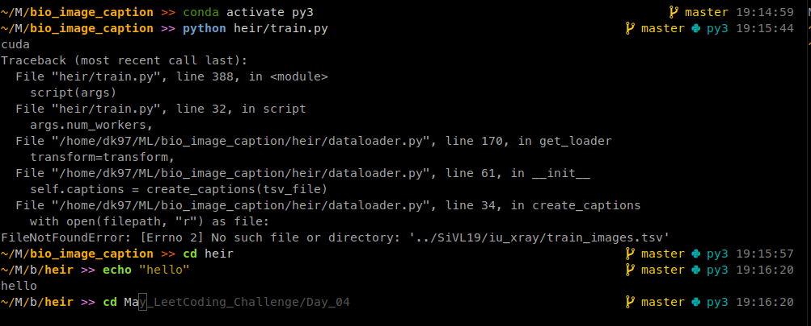
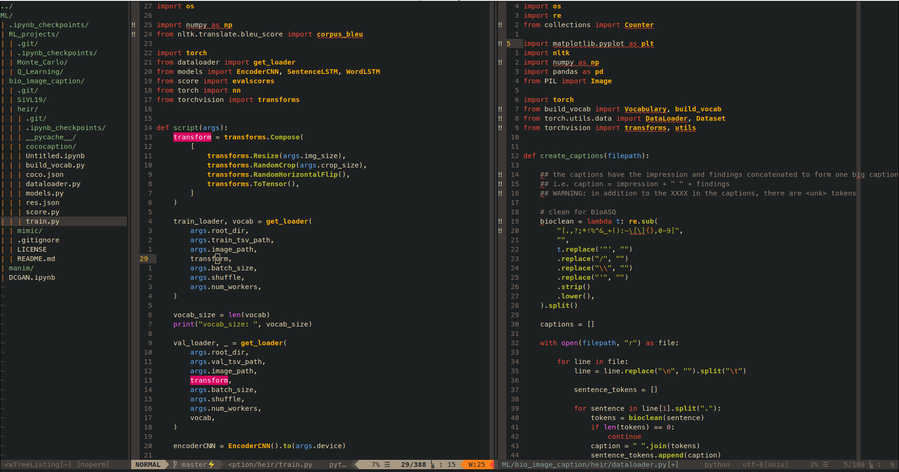

# My Ubuntu Configuration
This repository contains my current linux environment configuration. It facilitates a quick and easy setup on other Ubuntu systems. How it looks after setup:





## I. Prerequisites

Make sure the terminal supports 256 colors so that `zsh` shows proper colors. This can be done by running the following command on your terminal:

```bash
tput colors
```
The output should be `256`.

## II. Setup

### Start Installation
1. Run this command to start environment setup:

```bash
apt install -y curl && \
curl https://raw.githubusercontent.com/dakshitagrawal97/.cfg/master/setup.sh?token=AFCJ5OCL4DHP6HZDQMLX3Q27HDIXU -o setup.sh && \
bash setup.sh
```

### During Installation

2. Type in your github account credentials if prompted.
3. Press `ENTER` when asked if you want to change your default shell to zsh.
4. Type `exit` to exit zsh and continue setup.

If you do not have miniconda at `$HOME/miniconda`, it will get installed:

5. Press `ENTER` to start `miniconda` installation.
6. Press `d` to scroll down and type `yes` to accept the license.
7. Press `ENTER` to confirm location of install as `$HOME/miniconda3`.
8. Type `no` or press `ENTER` to not initialize Miniconda3 by running `conda init`.

### After Installation

9. Type `zsh` followed by `nvim`.
10. Press `ENTER` to open up the NVIM introduction page.
11. Type `:PlugInstall` and keep pressing `ENTER` until the installer prompt at the bottom closes.
12. Type `:q` and press `ENTER` to exit installation progress window.
13. Type `:UpdateRemotePlugins` and press `ENTER` to continue.
14. Exit `nvim` by typing `:q`
15. Type `conda env create -f $HOME/conda.yml` to recreate conda environment.

## III. Resources

The following resources were helpful in setting up this repository:

* [Atlassian's dotfile tutorial](https://www.atlassian.com/git/tutorials/dotfiles)

The following resources were helpful in customizing my dotfiles.
* [A Complete Guide to Setting up Neovim for Python Development on Linux](https://jdhao.github.io/2018/12/24/centos_nvim_install_use_guide_en/)
* GitHub READMEs of various plugins
